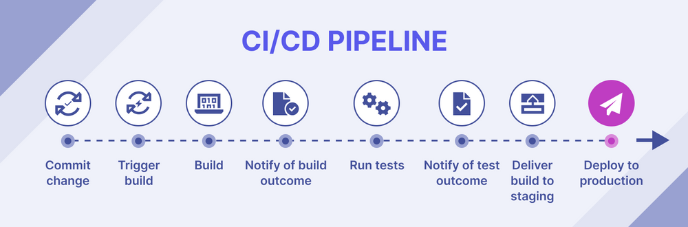

*[CI]: Continuous Integration
*[CD]: Continuous Deployment

# :fontawesome-solid-gears: Automatització
Un aspecte clau del desenvolupament modern de programari és
__l'automatització__ de tasques repetitives, ja que accelera el procés de
lliurament de noves funcionalitats i millora la qualitat del projecte,
sense necessitat d'intervenció manual.

## Integració contínua i desplegament continu (CI/CD)
- __Integració contínua (_Continuous Integration_ o CI)__: consisteix en
    integrar els canvis a la branca principal de manera contínua i
    freqüent, executant de manera automàtica les
    [[proves|:material-marker-check: proves del programari]] i altres
    validacions cada vegada que s'integra un canvi. Això permet detectar
    errors de manera més ràpida i senzilla.
- __Desplegament continu (_Continuous Deployment_ o CD)__: consisteix en
    automatitzar el procés de [[desplegament|:material-cloud-upload: desplegament]]
    de l'aplicació, des de la compilació fins a la publicació en el
    servidor de producció.

/// attribution
[Katalon](https://katalon.com/)
///
/// figure-caption
Exemple d'un flux de treball de CI/CD.
///

## :octicons-play-16: GitHub Actions
En aquest projecte, s'utilitzarà [:octicons-play-16: GitHub Actions][actions]
per a definir els fluxos de treball automatitzats. Es configuren mitjançant
fitxers `YAML` situats en el directori `.github/workflows/`, i s'executen
automàticament quan es compleix algun dels esdeveniments configurats, com
ara:

- `pull_request`: quan s'obri o s'actualitze una Pull Request.
- `push`: quan es puja un canvi a una branca concreta.
- `release`: quan es crea un nou [:material-tray-arrow-up: Llançament (_Release_)][releases].
- `workflow_dispatch`: per a poder executar el flux de treball manualment.

## Tasques automatitzades en el projecte
En aquest projecte, s'utilitzarà GitHub Actions per automatitzar les
següents tasques:

- Executar les [:material-marker-check: Proves del programari][proves] quan una
    :material-source-pull: _Pull Request_ estiga preparada per a ser revisada.
- Executar validacions d'estil en el codi font quan una
    :material-source-pull: _Pull Request_ estiga preparada per a ser revisada.
- Compilar i empaquetar el codi del projecte quan es realitze un nou
    [:material-tray-arrow-up: Llançament (_Release_)][releases].
- Publicar automàticament el [[desplegament|:material-cloud-upload: desplegament]]
    de l'aplicació en el servidor de producció quan es realitze un nou
    [:material-tray-arrow-up: Llançament (_Release_)][releases].

## :octicons-key-asterisk-16: Secrets
El desplegament automatitzat necessitarà informació sensible per a
connectar-se als servidors (credencials d'accés, claus SSH, etc.). Aquesta
informació __mai s'ha d'incloure directament__ en els fitxers de
configuració, ja que són públics i accessibles a qualsevol persona amb
accés al repositori.

GitHub Actions permet gestionar aquesta informació de manera segura
mitjançant els __:octicons-key-asterisk-16: Secrets__: variables que es
poden utilitzar en els fluxos de treball, però que no són visibles en els
fitxers de configuració. Es configuren en
__:octicons-gear-24: Settings > :octicons-key-asterisk-16: Secrets and
variables > Actions__ del repositori.

[proves]: proves.md
[actions]: https://github.com/features/actions
[releases]: https://docs.github.com/en/repositories/releasing-projects-on-github/about-releases
