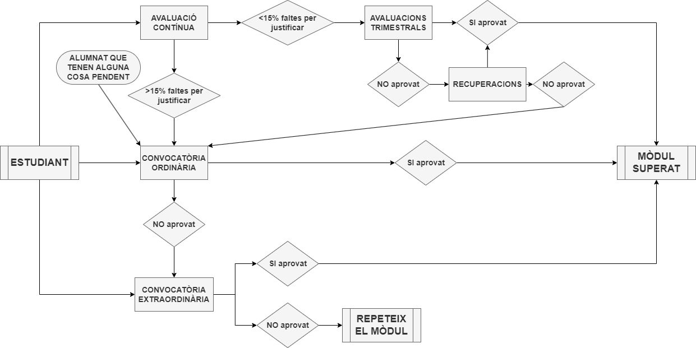

*[ABP]: Aprenentatge Basat en Projectes
*[IA]: Instrument d'avaluació
*[RA]: Resultat d'aprenentatge
*[PCCF]: Projecte Curricular de Cicle Formatiu

_Control de versions:_

| Data | Descripció |
| --- | --- |
| 2026-09-01 | Primera versió curs 26/27 |

## 1. Propostes de millora del curs anterior
Aquest mòdul no té cap proposta de millora del curs anterior,
ja que és la primera vegada que s'imparteix.

## 2. Marc normatiu
##### Estatal
- [LLEI ORGÀNICA 3/2022, de 31 de març, d'ordenació i integració de la Formació
    Professional](https://www.boe.es/eli/es/lo/2022/03/31/3)
- [REIAL DECRET 659/2023, de 18 de juliol, pel qual es desenvolupa l'ordenació del Sistema
    de Formació Professional.][659-2023]
- [REIAL DECRET 686/2010, de 20 de maig, pel qual s'establix el títol de
    Tècnic Superior en Desenvolupament d'Aplicacions Web i es fixen els
    ensenyaments mínims.](https://www.boe.es/eli/es/rd/2010/05/20/686)
- [REIAL DECRET 500/2024, de 21 de maig, pel qual es modifiquen determinats reials
    pels quals s'establixen títols de Formació Professional de grau superior
    es fixen els seus ensenyaments mínims.][500-2024]
- [REIAL DECRET 405/2023, de 29 de maig, pel qual s'actualitzen els títols de la formació
    professional del sistema educatiu de Tècnic Superior en Desenvolupament d'Aplicacions Multiplataforma
    i Tècnic Superior en Desenvolupament d'Aplicacions Web, de la família professional Informàtica i Comunicacions,
    i es fixen els seus ensenyaments mínims.][405-2023]

[659-2023]: https://www.boe.es/eli/es/rd/2023/07/18/659
[500-2024]: https://www.boe.es/eli/es/rd/2024/05/21/500
[405-2023]: https://www.boe.es/eli/es/rd/2023/05/29/405

##### Autonòmic
- [DECRET 114/2025, de 29 de juliol, del Consell,
    pel qual s'establixen els currículums dels cicles formatius de grau mitjà i de grau superior de Formació Professional,
    en aplicació de la Llei orgànica 3/2022, de 31 de març, d'ordenació i integració de la Formació Professional.][114-2025]
- [ORDRE 8/2025, de 22 d'abril, de la Conselleria d'Educació, Cultura, Universitats i Ocupació, per la qual es regula
    l'avaluació del procés d'ensenyança-aprenentatge en cicles formatius i cursos d'especialització derivats de la Llei
    orgànica 3/2022, de 31 de març, d'ordenació i integració de la Formació Professional][8-2025]
- [RESOLUCIÓ de 16 de juliol de 2026, de la Secretaria Autonòmica d'Educació,
    per la qual es dicten instruccions sobre ordenació acadèmica i d'organització
    dels centres que impartisquen els graus D i E de Formació Professional durant
    el curs 2026-2027 a la Comunitat Valenciana](https://dogv.gva.es/datos/2026/07/20/pdf/2026_24495_va.pdf)

[114-2025]: https://dogv.gva.es/va/eli/es-vc/d/2025/07/29/114/dof/vci/html
[8-2025]: https://dogv.gva.es/datos/2025/04/30/pdf/2025_13083_va.pdf

_TODO: si aquest mòdul de Projecte Intermodular té una guia o normativa
pròpia (com en el cas d'ASIX), afegir-la ací._

## 3. Contextualització
- __Codi__: TODO
- __Durada__: TODO hores
- __Crèdits ECTS__: TODO

La finalitat d'aquest projecte és integrar les competències adquirides en la resta dels
mòduls del curs, especialment allò relacionat amb la cerca d'informació, la
innovació, la investigació aplicada i el treball en equip. A més, fomenta el treball
col·laboratiu, el pensament crític i l'autonomia de l'estudiant.

## 4. Metodologia didàctica
La metodologia que s'utilitzarà en aquest mòdul està inspirada en l'__Aprenentatge Basat en Projectes (ABP)__.
En lloc de seguir un enfocament tradicional, on l'alumne rep informació de forma passiva, aquesta metodologia
el situa en el centre del procés d'aprenentatge.

Això es tradueix en els següents principis:

- __Aprenentatge Actiu__: L'alumne és el principal protagonista del seu aprenentatge.
    S'encarrega d'investigar, resoldre problemes, prendre decisions i construir la solució,
    amb el professor actuant com a guia i facilitador.
    El focus està en el "fer", més que en el "escoltar".

- __Resolució de Problemes Reals__: El projecte tracta de simular una situació real,
    on l'alumnat haurà d'aplicar els seus coneixements a un problema ambiciós i complex,
    el que afavoreix un aprenentatge més significatiu.

- __Treball en equip__: Atès que el projecte es realitza de forma grupal,
    es promou la col·laboració entre els membres de l'equip.
    Això desenvolupa habilitats socials, de comunicació i de treball en equip,
    que són essencials en el món laboral.

- __Autonomia i Gestió__: L'alumnat és responsable de la planificació i gestió del projecte,
    seguint la metodologia [[scrum|:octicons-iterations-16: SCRUM]].
    Això inclou establir objectius, responsabilitzar-se de les tasques assignades i gestionar el temps,
    fomentant l'autonomia i la responsabilitat.

- __Avaluació Formativa i Contínua__: L'avaluació no se centrarà únicament en el resultat final,
    sinó que serà un procés continu. Cada sprint actua com un punt de control que permet al professorat
    i a l'alumnat identificar els punts forts i les àrees de millora,
    realitzant ajustos en la planificació si és necessari per a assegurar l'èxit.

[scrum]: ../gestio/scrum.md

## 5. Competències del mòdul

### 5.1. Objectius generals. Competències professionals, personals i socials. Continguts.
No s'han definit a aquest mòdul professional.

### 5.2. Resultats d'aprenentatge
Aquest mòdul contindrà els resultats d'aprenentatge (RA) dels següents
mòduls professionals, consensuats pel equip educatiu.

##### TODO – Projecte Intermodular
- __PI-RA1__: Planifica i gestiona un projecte tecnològic definint objectius, tasques, terminis i recursos, utilitzant metodologies de treball adequades i elaborant la documentació necessària per garantir un desenvolupament estructurat i eficient.
- __PI-RA2__: Utilitza eines de control de versions per gestionar el codi, mantindre un historial de canvis, resoldre conflictes i facilitar el treball col·laboratiu.
- __PI-RA3__: Participa activament en el treball en grup, assumint responsabilitats, comunicant-se de manera efectiva i col·laborant en la presa de decisions per aconseguir els objectius.

##### TODO – [[rubriques-bd|Bases de dades]]
_(RA pendents d'especificar pel mòdul de Bases de dades.)_

##### TODO – [[rubriques-ed|Entorns de desenvolupament]]
_(RA pendents d'especificar pel mòdul d'Entorns de desenvolupament.)_

##### TODO – [[rubriques-llmq|Llenguatge de marques i sistemes de gestió de la informació]]
_(RA pendents d'especificar pel mòdul de Llenguatge de marques i sistemes de gestió de la informació.)_

##### TODO – [[rubriques-prg|Programació]]
_(RA pendents d'especificar pel mòdul de Programació.)_

##### TODO – [[rubriques-si|Sistemes informàtics]]
_(RA pendents d'especificar pel mòdul de Sistemes informàtics.)_

### 5.3. Resultats d'aprenentatge a la Formació en Empresa
Aquest mòdul no té cap resultat d'aprenentatge específic que
s'haja de desenvolupar a la Formació en Empresa (FE).

## 6. Distribució temporal
La distribució temporal dels sprints i els resultats d'aprenentatge
associats és la següent:


/// figure-caption: Distribució temporal dels sprints i els resultats d'aprenentatge associats.

## 7. Avaluació i qualificació

/// attribution: CIPFP Mislata
/// figure-caption : Diagrama de convocatòries

### 7.1. Avaluació
L'avaluació del mòdul es basarà en l'adquisició dels __resultats d'aprenentatge (RA)__
definits per a aquest mòdul professional, per tant, es realitzarà una avaluació
dedicada a cada RA.

Totes les tasques que requerisquen d'una avaluació i qualificació s'han d'entregar a temps
i han de complir amb els requisits d'entrega.
Si no s'entreguen en temps i forma, es consideraran com a no presentades.

La manca d'autenticitat en l'autoria o d'originalitat de les proves d'avaluació; la còpia o el plagi;
l'intent fraudulent d'obtenir un resultat acadèmic millor; la col·laboració, l'encobriment o l'afavoriment de la còpia,
o la utilització de material, aplicacions o dispositius no autoritzats durant l'avaluació, entre d'altres,
són conductes irregulars que poden tenir conseqüències acadèmiques i disciplinàries greus.

D'una banda, si es detecta alguna d'aquestes conductes irregulars, pot comportar el suspens en les activitats
avaluables o en la qualificació final de l'assignatura.

D'altra banda, i d'acord amb la normativa acadèmica, les conductes irregulars en l'avaluació, a més de comportar el suspens de l'assignatura,
poden donar lloc a la incoació d'un procediment disciplinari i a l'aplicació, si escau, de la sanció corresponent.

### 7.2. Qualificació
La __qualificació del mòdul__ es calcularà mitjançant una mitjana
ponderada de les qualificacions de cada sprint, que alhora es calcularan
mitjançant una mitjana ponderada de les qualificacions dels RA que conté cada sprint.

En cas que algun RA no s'haja superat,
la qualificació del mòdul serà com a màxim un 4.

Per norma general les notes s'arredoniran amb la fórmula general: __>.5__.
No obstant això, en l'interval $[4, 5)$ la nota s'arredonirà a 5 sols a partir de 4.75.

La ponderació de cada sprint en la qualificació del mòdul és la següent _(TODO: pendent de decidir)_:

/// html | div.center
| Sprint | Percentatge |
| :----- | :---------- |
| Sprint 1 | TODO |
| Sprint 2 | TODO |
| Sprint 3 | TODO |
| Sprint 4 | TODO |
| Sprint 5 | TODO |
| Sprint 6 | TODO |
/// figure-caption: Ponderació de cada sprint en la qualificació del mòdul.
///

El desglossament de la ponderació dels RA associats a cada sprint es pot consultar a [[avaluacio]].

### 7.3 Criteris d'avaluació mínims per superar el mòdul
Per poder superar el mòdul, l'alumnat haurà de:

- Superar __tots els RA__ amb una qualificació mínima de 5.
- Tindre un comportament adequat a l'aula i complir les
  normes de convivència.

### 7.4. Avaluació contínua
L'avaluació es realitzarà amb els següents instruments d'avaluació (IA),
detallats a [[avaluacio|:material-check: Avaluació]]:

- __Rúbriques tècniques o específiques__: Avaluaran els aspectes vinculats amb cada RA.
    Cada mòdul professional implicat proporcionarà les rúbriques específiques
    per avaluar els RA que li corresponen.
- __Proves de validació__: L'equip educatiu pot decidir realitzar proves de validació
    als membres d'un grup per tal de comprovar que han entès i
    saben aplicar els conceptes tècnics treballats al projecte.

La __nota de cada avaluació__ serà una instantània
de la __qualificació del mòdul__ en el moment de l'avaluació,
on sols es tindran en compte els instruments d'avaluació realitzats fins a eixe moment.

La qualificació final del mòdul serà la nota de l'__última avaluació__,
on s'hauran avaluat tots els instruments d'avaluació de tots els RA.

### 7.5. Convocatòries ordinàries
L'alumnat té dret a dues convocatòries ordinàries en un curs acadèmic.

En aquesta convocatòria, l'alumnat que no haja superat algun
dels RA en l'avaluació contínua haurà de realitzar, de manera individual,
les tasques pendents per a superar els RA no superats, que s'avaluaran
utilitzant els mateixos IA que en l'avaluació contínua.

Es mantindrà la qualificació obtinguda en els RA superats en l'avaluació contínua.

Per superar la convocatòria ordinària, __l'alumnat haurà de superar
tots els RA__.

### 7.6. Avaluació de la pràctica docent
Al final del curs es realitzarà un qüestionari per avaluar la pràctica
docent, la qualitat dels materials i el procés d'aprenentatge.

## 8. Materials i recursos didàctics

- Pantalla digital
- Pissarra
- Plataforma educativa __Aules__: Publicació de material, continguts, activitats, correccions i rúbriques.
- Ordinadors amb accés a internet.
- Correu corporatiu.
- Eines de control de versions: __:simple-git: Git__
- Llocs d'allotjament de repositoris Git: __:simple-github: GitHub__
- Eines de contenidorització: __:simple-docker: Docker__
- Eines de virtualització: __:simple-proxmox: Proxmox VE__
- Plataforma en el núvol: __:material-aws: Amazon Web Services (AWS)__

## 9. Activitats complementàries i extraescolars
No s'ha contemplat cap activitat complementària específica per a aquest mòdul professional.

## 10. Temes transversals
Els temes transversals a tractar al mòdul professional al llarg del curs estan relacionats
amb el desenvolupament de les capacitats de relacions socials i comunicatives dels alumnes,
enteses com un complement necessari i important a incloure en qualsevol titulació de tipus tècnica.

Els temes transversals concrets a tractar són els següents:

- Desenvolupar habilitats de relació social i interpersonal.
- Potenciar les actituds comunicatives, de negociació i de treball en grup.
- Fomentar la motivació.
- Saber afrontar conflictes provocats per les limitacions
    tecnològiques sempre presents en un entorn tecnològic tan dinàmic i en contínua evolució
    com és el sector informàtic.

## 11. Mesures de resposta educativa per a la inclusió
Es tindrà en compte a l'alumnat que necessite més atenció, de manera que
es garantirà l'accessibilitat a tots els mitjans comuns.

Accions que es portaran a terme:

- Estimulació del treball en grup de manera remota. La composició dels grups
    serà supervisada pel docent per aconseguir grups amb nivells heterogenis.
- Facilitar l'accessibilitat dels materials i recursos didàctics.
- Flexibilització en les temporitzacions de les activitats
    (realització d'exàmens, entrega de pràctiques, treball personal, etc.).
